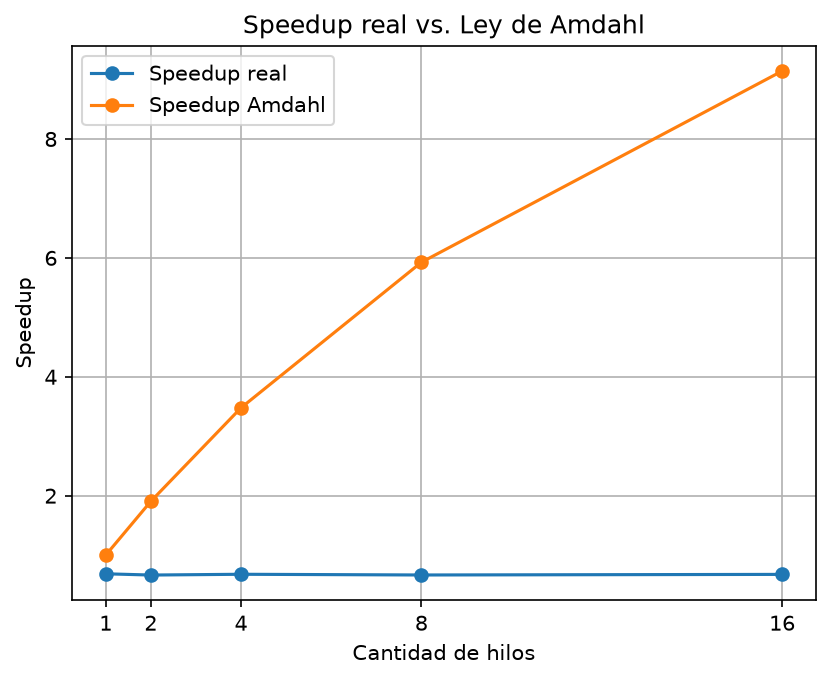

# Hito 1 - Concurrencia en CPU

## Objetivo

El objetivo de este hito es implementar y analizar una solucion concurrente para un problema de paralelismo de datos en CPU.

El problema que elegimos consiste en calcular la suma de un vector grande de numeros de tipo `float`, comparando una implementacion secuencial con otra implementacion que utiliza varios hilos.

La implementacion fue realizada en Python utilizando el modulo `threading`.

---

## Problema

Se genera un vector de `N = 16.777.216` elementos, donde todos los valores son `1.0`.

La operacion que se realiza es:

$$
S = \sum_{i=0}^{N-1} x_i
$$

Como todos los elementos tienen valor `1.0`, el resultado esperado es:

$$
S = N = 16.777.216
$$

Para resolver el problema se hicieron dos versiones:

* `secuencial.py`: realiza la suma utilizando un solo flujo de ejecucion.
* `paralelo.py`: divide el vector en bloques y reparte el trabajo entre varios hilos.

---

## Implementacion secuencial

En la version secuencial se recorren todos los elementos del vector uno por uno y se va acumulando el resultado en una variable.

Para medir el tiempo utilizado se utiliza `time.perf_counter()`.

---

## Implementacion concurrente

En la version concurrente se utilizan:

* `threading.Thread` para crear los hilos.
* `threading.Lock` como mecanismo de sincronizacion.
* Bloques de `100.000` elementos.
* Una suma local para cada hilo.
* `join()` para esperar a que todos los hilos terminen.

El `Lock` se utiliza para controlar el acceso a la variable que indica cual es el proximo bloque que tiene que procesarse. De esta manera, dos hilos no pueden tomar el mismo bloque al mismo tiempo.

La suma de los elementos se realiza fuera del `Lock`, para evitar mantener bloqueado el recurso compartido mientras se hace todo el procesamiento.

---

## Metodologia de medicion

Para realizar las pruebas se utilizo el archivo `benchmark.py`.

Las pruebas se realizaron de la siguiente manera:

* Tamano del vector: `16.777.216` elementos.
* Cantidad de repeticiones: `5`.
* Se utiliza la mediana de las cinco mediciones.
* Se probaron `1`, `2`, `4`, `8` y `16` hilos.

El speedup se calcula mediante:

$$
S(T) = \frac{T_{seq}}{T(T)}
$$

donde:

* \(T_{seq}\) es el tiempo de la version secuencial.
* \(T(T)\) es el tiempo de la version concurrente utilizando `T` hilos.

De esta forma podemos comparar cuanto tarda la version concurrente con respecto a la version secuencial.

---

## Hardware

Para realizar las pruebas se detectaron:

* **Procesadores logicos disponibles:** 16
* **Sistema operativo:** Windows
* **Lenguaje:** Python 3.11
* **Modulo utilizado para la concurrencia:** `threading`

---

## Resultados

El tiempo obtenido para la version secuencial fue:

**285.160 ms**

Los resultados obtenidos con la version concurrente fueron:

| Hilos | Tiempo mediano (ms) | Speedup real | Speedup Amdahl |
| ----: | ------------------: | -----------: | -------------: |
|     1 |             415.419 |        0.686 |          1.000 |
|     2 |             428.492 |        0.665 |          1.905 |
|     4 |             420.891 |        0.678 |          3.478 |
|     8 |             428.318 |        0.666 |          5.926 |
|    16 |             422.009 |        0.676 |          9.143 |

En todas las pruebas el resultado de la suma fue:

`16.777.216`

Esto coincide con el resultado esperado, por lo que las dos implementaciones realizan correctamente la suma del vector.

---

## Ley de Amdahl

Para comparar nuestros resultados con un resultado teorico, utilizamos la Ley de Amdahl:

$$
S(T) = \frac{1}{s + \frac{1-s}{T}}
$$

Para este calculo utilizamos una fraccion secuencial de:

$$
s = 0.05
$$

Este valor es una suposicion utilizada como referencia para hacer el calculo teorico. No fue obtenido a partir de una medicion del programa.

Los resultados teoricos obtenidos fueron:

| Hilos | Speedup Amdahl |
| ----: | -------------: |
|     1 |          1.000 |
|     2 |          1.905 |
|     4 |          3.478 |
|     8 |          5.926 |
|    16 |          9.143 |

---

## Grafico

El siguiente grafico permite comparar el speedup obtenido en las pruebas con el speedup teorico calculado mediante la Ley de Amdahl.

---
## Analisis de los resultados

Al analizar los resultados podemos ver que aumentar la cantidad de hilos no hizo que el programa fuera mas rapido que la version secuencial.

La version secuencial tuvo un tiempo mediano de `285.160 ms`, mientras que las versiones con hilos tuvieron tiempos superiores a `400 ms`.

El speedup real se mantuvo aproximadamente entre `0.66` y `0.69`, por lo que no se observa una mejora al aumentar la cantidad de hilos.

Una de las principales razones de este resultado es que estamos utilizando `threading` de Python para una tarea que requiere bastante procesamiento de CPU. Python utiliza el **Global Interpreter Lock (GIL)**, que limita la ejecucion simultanea de codigo Python por varios hilos dentro de un mismo proceso.

Ademas, la version concurrente tiene algunos costos adicionales. Por ejemplo:

* creacion y manejo de los hilos;
* uso del `Lock`;
* asignacion de los bloques;
* coordinacion entre los hilos;
* espera mediante `join()`;
* acceso a memoria.

Todos estos costos hacen que, en este caso, utilizar varios hilos termine siendo mas lento que hacer la suma de forma secuencial.

Tambien podemos observar que utilizar mas hilos no significa necesariamente obtener un mejor tiempo. Por ejemplo, entre 8 y 16 hilos practicamente no hubo una mejora en el tiempo obtenido.

Los resultados reales tambien son bastante diferentes de los valores obtenidos con la Ley de Amdahl. Esto se debe a que el calculo de Amdahl representa un modelo teorico y supone que la parte paralelizable del programa puede ejecutarse realmente en paralelo. En nuestro caso existen las limitaciones propias de Python y de `threading`.

Por lo tanto, los resultados muestran que no alcanza solamente con aumentar la cantidad de hilos o tener mas procesadores logicos disponibles. Tambien hay que tener en cuenta como se ejecuta el programa y los costos que agrega la concurrencia.

---

## Conclusiones

En este hito implementamos una version secuencial y una version concurrente para realizar la suma de un vector grande.

La version concurrente utiliza `Thread` y `Lock`, cumpliendo con el requisito de utilizar una primitiva de sincronizacion.

Las pruebas realizadas muestran que, para este problema y utilizando `threading` en Python, la version concurrente no fue mas rapida que la version secuencial.

Tambien pudimos comparar los resultados reales con la Ley de Amdahl y observar que existe una diferencia importante entre el resultado teorico y el comportamiento real del programa.

Con este experimento podemos ver que la cantidad de hilos no garantiza por si sola una mejora de rendimiento. Hay que tener en cuenta factores como la sincronizacion, el manejo de los hilos, el acceso a memoria y las caracteristicas del lenguaje utilizado.

